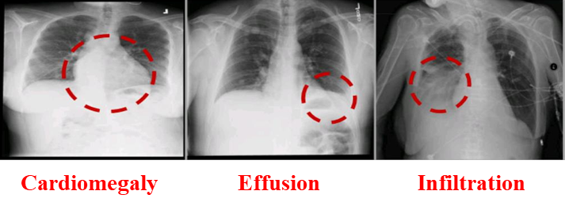
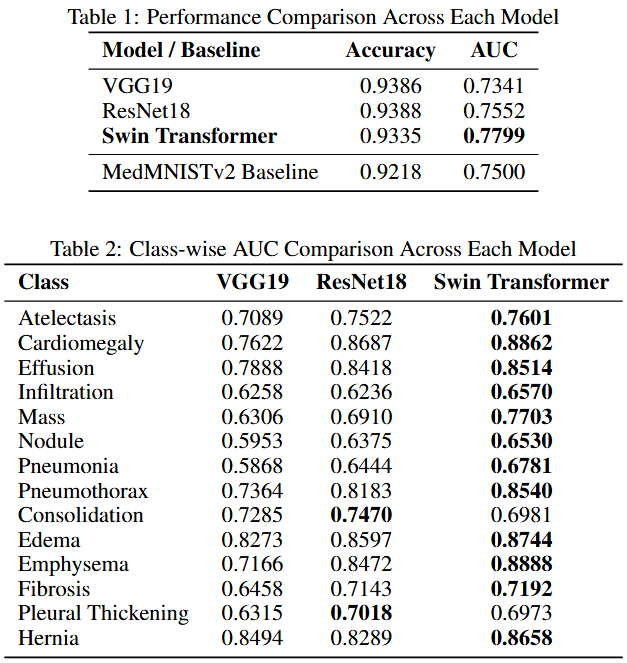

## CheX-Swin: Chest X-Ray Classification Using Swin Transformer

[Full Paper (PDF)](https://nickdisanto.github.io/assets/pdfs/CheX-Swin.pdf)

Accurate classification of chest X-rays is critical for early diagnosis of pulmonary diseases, especially in clinical settings where professional opinions are increasingly difficult to come by. Thus, there exists a need for automated procedures that can provide quick and accurate diagnoses. In this work, we evaluate whether the **Swin Transformer**, a hierarchical Vision Transformer that employs shifted window self-attention, can outperform traditional CNN-based models such as ResNet18 and VGG19 on medical classification tasks. We perform our evaluation on the ChestMNIST dataset, a large and highly imbalanced benchmark for robust classification. In order to verify whether Swin is a comparable alternative to CNN baselines through its ability to capture global context and long-range dependencies, we implemented all three models with identical training conditions so that they focus exclusively on subtle disease patterns. While our results show high classification accuracy (>93%) across all three of the models, Swin consistently performs the highest in both overall and classwise AUC, which was our metric of interest due to its sensitivity to class imbalance. Additionally, all three of our implemented and fine-tuned models surpassed the performance of the original MedMNISTv2 benchmark. These findings reinforce the promise of transformer-based architectures in advancing clinical AI applications for medical imaging tasks requiring both local detail and global contextual understanding. All source code is publicly available at GitHub.

You can download the **ChestMNIST X-Ray dataset** from [this Box link](https://nihcc.app.box.com/v/ChestXray-NIHCC/file/220660789610).

<p align="center">  </p>

---

## Usage

1. Clone the repository:
   ```bash
   git clone https://github.com/NickDiSanto/CheX-Swin.git
   cd CheX-Swin
   ```

2. Install the required dependencies:
   ```bash
   pip install -r requirements.txt
   ```

3. Train model(s) and run experiments:
   ```bash
   python experiments.py \
   --dataset_name ChestXray14 \
   --epochs 40 \
   --batch_size 24 \
   --num_trial 1
   --lr 1e-3
   ```

---

## Results

<p align="center">  </p>

---

## Acknowledgements
We gratefully acknowledge the following papers, which inspired or contributed to this work:

- [Swin Transformer](https://openaccess.thecvf.com/content/ICCV2021/papers/Liu_Swin_Transformer_Hierarchical_Vision_Transformer_Using_Shifted_Windows_ICCV_2021_paper.pdf)

- [ResNet18](https://www.cv-foundation.org/openaccess/content_cvpr_2016/papers/He_Deep_Residual_Learning_CVPR_2016_paper.pdf)

- [VGG19](https://arxiv.org/pdf/1409.1556)

---

## License

This project is licensed under the MIT License. See the [LICENSE](LICENSE) file for details.
